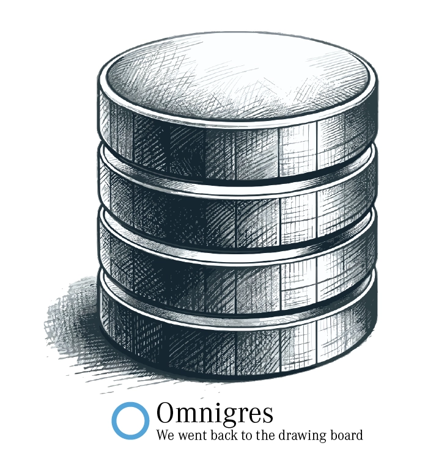

<p align="center">

</p>

<p align="center">
<a href="https://docs.omnigres.org"><b>Documentation</b></a> |
<a href="https://github.com/omnigres/omnigres/wiki/Bounties"><b>Bounties</b></a>
</p>

---

[][Discord]
[](https://docs.omnigres.org)


Omnigres makes Postgres a developer-first application platform. You can deploy a single database instance and it can host your entire application, scaling as needed.

* Running application logic **inside** or **next to** the database instance
* **Deployment** provisioning (**Git**, **containers**, etc.)
* Database instance serves **HTTP**, **WebSocket** and other protocols
* In-memory and volatile on-disk **caching**
* Routine application building blocks (**authentication**, **authorization**, **payments**, etc.)
* Database-modeled application logic via **reactive** queries
* Automagic remote **APIs** and **form** handling
* **Live** data updates

## Blogs and Publications

* [Omnigres blog](https://blog.omnigres.com)

## :runner: Quick start

The fastest way to try Omnigres out is by using its [container image](https://github.com/omnigres/omnigres/pkgs/container/omnigres):

```shell
docker volume create omnigres
docker run --name omnigres --mount source=omnigres,target=/var/lib/postgresql/data \
           -p 127.0.0.1:5432:5432 -p 127.0.0.1:8080:8080 -p 127.0.0.1:8081:8081 --rm ghcr.io/omnigres/omnigres-17:latest
# Now you can connect to it:
psql -h localhost -p 5432 -U omnigres omnigres # password is `omnigres`
```

> [!TIP]
> Replace `ghcr.io/omnigres/omnigres-17` with `ghcr.io/omnigres/omnigres-extra-17` if you want an image with a lot more batteries included.

Postgres parameters such as database, user or password can be overridden as per the
"Environment Variables" section in [postgres image instructions](https://hub.docker.com/_/postgres/)

You can access the default HTTP server at [localhost:8081](http://localhost:8081)

### Building your own image

If you can't use the pre-built image (for example, you are running a fork or made changes), you can build the image yourself:

```shell
# Build the image
DOCKER_BUILDKIT=1 docker build . -t ghcr.io/omnigres/omnigres
```

## Download omnigres extensions

Omnigres extensions can also
be [downloaded and installed](https://docs.omnigres.org/omni_manifest/usage/#download-omnigres-extensions)
in any postgres installation with file system access.

## :wave: "Hello, world"

Here we expect you are running the [container image](#-runner--quick-start), which has
omni_httpd and omni_web extensions provisioned by default.

Let's start with a traditional example. Here we will instruct the handler that
is provisioned by omni_httpd by default to use the enclosed query to greet the
world.

Below, we'll show examples in Python and plain SQL (or PL/pgSQL). Support for
more languages is coming!

```shell
$ curl localhost:8081
Hello, world!
```

<details>
<summary>Python (Flask) implementation</summary>

```python
from omni_python import pg
from flask import Flask
from omni_http.omni_httpd import flask

app = Flask('myapp')


@app.route('/')
def hello():
    return "Hello, world!"


handle = pg(flask.Adapter(app))
```

To connect the endpoint:

```sql
insert into omni_httpd.urlpattern_router (match, handler)
values (omni_httpd.urlpattern('/'), 'my_handler'::regproc);
```

**NB**: Please note that you will need to
[follow Python setup steps](https://docs.omnigres.org/omni_python/intro/)
for the time being before our CLI tooling is ready.

</details>

<details>
<summary>Plain SQL</summary>

You can also achieve the same using plain SQL with very little setup.

```sql
create function my_handler()
  returns omni_httpd.http_outcome
  return omni_httpd.http_response('Hello world!');

insert into omni_httpd.urlpattern_router (match, handler)
values (omni_httpd.urlpattern('/'), 'my_handler'::regproc);
```
</details>

Now, let's make it more personal and let it greet the requester by name.

```shell
$ curl "localhost:8081?name=John"
Hello, John!
```

<details>
<summary>Python (Flask) implementation</summary>

```python
from flask import request  # we need to access `request`


@app.route('/')
def hello():
    return f"Hello, {request.args.get('name', 'world')}!"
```

</details>

<details>
<summary>Plain SQL</summary>

```sql
update omni_httpd.handlers
set
    query =
        $$select omni_httpd.http_response('Hello, ' || 
                   coalesce(omni_web.param_get(request.query_string, 'name'), 'world') || '!')
          from request$$;
```

</details>

This, of course, only barely scratches the surface, but it may give you a very high-level concept
of how Omnigres web services can be built.

For a more complex example, that uses the underlying database and employs more real-world layout, check out
this [MOTD service example](https://docs.omnigres.org/examples/motd/).

## :building_construction: Component Roadmap

Below is the current list of components being worked on, experimented with and discussed. This list will change
(and grow) over time.

| Name                                                                                     | Status                                       | Description                                           |
|------------------------------------------------------------------------------------------|----------------------------------------------|-------------------------------------------------------|
| [omni](extensions/omni/README.md) and [Omni interface](omni/README.md)                   | :white_check_mark: First release candidate   | Advanced adapter for Postgres extensions              |
| [omni_service](extensions/omni_service/README.md)                                        | :white_check_mark: First release candidate   | Uniform service management bus                        |
| [omni_test](extensions/omni_test/README.md)                                              | :white_check_mark: First release candidate   | Testing framework                                     |
| [omni_schema](extensions/omni_schema/README.md)                                          | :white_check_mark: First release candidate   | Application schema management                         |
| [omni_credentials](extensions/omni_schema/README.md)                                     | :white_check_mark: First release candidate   | Application credential management                     |
| [omni_id](extensions/omni_id/README.md)                                                  | :white_check_mark: First release candidate   | Identity types                                        |
| [omni_aws](extensions/omni_aws/README.md)                                                | :white_check_mark: First release candidate   | AWS APIs                                              |
| [omni_cloudevents](extensions/omni_cloudevents/README.md)                                | :white_check_mark: First release candidate   | [CloudEvents](https://cloudevents.io/) support        |
| [omni_json](extensions/omni_json/README.md)                                              | :white_check_mark: First release candidate   | JSON toolkit                                          |
| [omni_yaml](extensions/omni_yaml/README.md)                                              | :white_check_mark: First release candidate   | YAML toolkit                                          |
| [omni_xml](extensions/omni_xml/README.md)                                                | :white_check_mark: First release candidate   | XML toolkit                                           |
| [omni_http](extensions/omni_http/README.md)                                              | :white_check_mark: First release candidate   | Common HTTP types library                             |
| [omni_httpd](extensions/omni_httpd/README.md), [omni_web](extensions/omni_web/README.md) | :white_check_mark: First release candidate   | Serving HTTP in Postgres and building services in SQL |
| [omni_rest](extensions/omni_rest/README.md)                                              | :white_check_mark: First release candidate   | Out-of-the-box REST API provider                      |
| [omni_session](extensions/omni_session/README.md)                                        | :white_check_mark: First release candidate   | Session management                                    |
| [omni_mimetypes](extensions/omni_mimetypes/README.md)                                    | :white_check_mark: First release candidate   | MIME types and file extensions                        |
| [omni_httpc](extensions/omni_httpc/README.md)                                            | :white_check_mark: First release candidate   | HTTP client                                           |
| [omni_sql](extensions/omni_sql/README.md)                                                | :construction: Extremely limited API surface | Programmatic SQL manipulation                         |
| [omni_vfs](extensions/omni_vfs/README.md)                                                | :ballot_box_with_check: Initial prototype    | Virtual File System interface                         |
| [omni_containers](extensions/omni_containers/README.md)                                  | :ballot_box_with_check: Initial prototype    | Managing containers                                   |
| [omni_manifest](extensions/omni_manifest/README.md)                                      | :ballot_box_with_check: Initial prototype    | Improved extension installation                       |
| [omni_types](extensions/omni_types/README.md)                                            | :white_check_mark: First release candidate   | Advanced Postgres typing techniques (sum types, etc.) |
| [omni_seq](extensions/omni_seq/README.md)                                                | :white_check_mark: First release candidate   | Extended Postgres sequence tooling                    |
| [omni_var](extensions/omni_var/README.md)                                                | :white_check_mark: First release candidate   | Variable management                                   |
| [omni_txn](extensions/omni_txn/README.md)                                                | :white_check_mark: First release candidate   | Transaction management                                |
| [omni_python](extensions/omni_python/README.md)                                          | :ballot_box_with_check: Initial prototype    | First-class Python Development Experience             |
| [omni_regex](extensions/omni_python/README.md)                                           | :white_check_mark: First release candidate   | Feature-rich regular expresssions                     |
| [omni_os](extensions/omni_os/README.md)                                                  | :ballot_box_with_check: Initial prototype    | Access to the operating system                        |
| [omni_polyfill](extensions/omni_polyfill/README.md)                                      | :white_check_mark: First release             | Provides polyfills for older versions of Postgres     |
| omni_git                                                                                 | :lab_coat: Early experiments (unpublished)   | Postgres Git client                                   |
| omni_reactive                                                                            | :spiral_calendar: Haven't started yet        | Reactive queries                                      |

## :keyboard: Hacking

## Building & using extensions

To build and run Omnigres, you would need:

* a recent C compiler
* OpenSSL 3.2 (**optional**, will be built if not available)
* cmake >= 3.25.1
* (optionally, to use omni_containers or run a full set of tests) a recent
  version of Docker

<details>
<summary>Dependencies for Fedora</summary>

* Packages: `git cmake gcc g++ cpan openssl-devel openssl-devel-engine python-devel openssl bison flex readline-devel zlib-devel netcat`
* CMake flags: `-DOPENSSL_CONFIGURED=1`

</details>

<details>
<summary>Dependencies for macOS</summary>

* XCode Command Line Tools: `xcode-select --install`
* Homebrew packages: `cmake openssl python`

</details>

```shell
cmake -S . -B build
cmake --build build --parallel
make -j psql_<COMPONENT_NAME> # for example, `psql_omni_containers`
```

To install extensions into your target Postgres:

```shell
cmake --build build --parallel --target install_extensions
# Or, individually,
cmake --build build --parallel --target install_<COMPONENT_NAME>_extension
```

### Troubleshooting

<details>
<summary>cmake not picking up Python version you want?</summary>

To use a specific Python build use the cmake flag `Python3_EXECUTABLE`:

```
cmake -S . -B build -DPython3_EXECUTABLE=/path/to/python
```

</details>

<details>
<summary>Build fails for whatever other reason?</summary>

Remove `build` and `.pg` directories for a clean rebuild:

```
rm -rf .pg build
```

</details>

### Running tests

```shell
# in the build directory
CTEST_PARALLEL_LEVEL=$(nproc) make -j $(nproc) all test
```

### Contributing

Once you are ready to contribute, please check out the [contribution guidelines](CONTRIBUTING.md).


[Discord]: https://discord.omnigr.es
