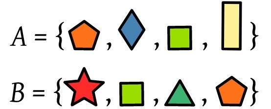

# STC [cset](../include/stc/cset.h): Unordered Set


A **cset** is an associative container that contains a set of unique objects of type i_key. Search, insertion, and removal have average constant-time complexity. See the c++ class
[std::unordered_set](https://en.cppreference.com/w/cpp/container/unordered_set) for a functional description.

## Header file and declaration

```c
#define i_type      // container type name (default: cset_{i_key})
#define i_key       // hash key: REQUIRED.
#define i_hash      // hash func: REQUIRED IF i_keyraw is a non-pod type.
#define i_eq        // equality comparison two i_keyraw*: !i_cmp is used if not defined.
#define i_keydrop   // destroy key func - defaults to empty destruct
#define i_keyclone  // REQUIRED IF i_keydrop defined

#define i_keyraw    // convertion "raw" type - defaults to i_key
#define i_keyfrom   // convertion func i_keyraw => i_key - defaults to plain copy
#define i_keyto     // convertion func i_key* => i_keyraw - defaults to plain copy

#define i_tag       // alternative typename: cmap_{i_tag}. i_tag defaults to i_val
#define i_ssize      // default int32_t. If defined, table expand 2x (else 1.5x)
#include <stc/cset.h>
```
`X` should be replaced by the value of `i_tag` in all of the following documentation.

## Methods

```c
cset_X              cset_X_init(void);
cset_X              cset_X_with_capacity(intptr_t cap);
cset_X              cset_X_clone(cset_x set);

void                cset_X_clear(cset_X* self);
void                cset_X_copy(cset_X* self, const cset_X* other);
float               cset_X_max_load_factor(const cset_X* self);              // default: 0.85
bool                cset_X_reserve(cset_X* self, intptr_t size);
void                cset_X_shrink_to_fit(cset_X* self);
void                cset_X_drop(cset_X* self);                               // destructor

bool                cset_X_empty(const cset_X* self);
intptr_t            cset_X_size(const cset_X* self);                         // num. of allocated buckets
intptr_t            cset_X_capacity(const cset_X* self);                     // buckets * max_load_factor
intptr_t            cset_X_bucket_count(const cset_X* self);

bool                cset_X_contains(const cset_X* self, i_keyraw rkey);
const cset_X_value* cset_X_get(const cset_X* self, i_keyraw rkey);          // return NULL if not found
cset_X_value*       cset_X_get_mut(cset_X* self, i_keyraw rkey);            // mutable get
cset_X_iter         cset_X_find(const cset_X* self, i_keyraw rkey);

cset_X_result       cset_X_insert(cset_X* self, i_key key);
cset_X_result       cset_X_push(cset_X* self, i_key key);                    // alias for insert.
cset_X_result       cset_X_emplace(cset_X* self, i_keyraw rkey);

int                 cset_X_erase(cset_X* self, i_keyraw rkey);               // return 0 or 1
cset_X_iter         cset_X_erase_at(cset_X* self, cset_X_iter it);           // return iter after it
void                cset_X_erase_entry(cset_X* self, cset_X_value* entry);

cset_X_iter         cset_X_begin(const cset_X* self);
cset_X_iter         cset_X_end(const cset_X* self);
void                cset_X_next(cset_X_iter* it);

cset_X_value        cset_X_value_clone(cset_X_value val);
```

## Types

| Type name          | Type definition                                  | Used to represent...        |
|:-------------------|:-------------------------------------------------|:----------------------------|
| `cset_X`           | `struct { ... }`                                 | The cset type               |
| `cset_X_key`       | `i_key`                                          | The key type                |
| `cset_X_value`     | `i_key`                                          | The key type (alias)        |
| `cset_X_keyraw`    | `i_keyraw`                                       | The raw key type            |
| `cset_X_raw`       | `i_keyraw`                                       | The raw key type (alias)    |
| `cset_X_result`    | `struct { cset_X_value* ref; bool inserted; }`   | Result of insert/emplace    |
| `cset_X_iter`      | `struct { cset_X_value *ref; ... }`              | Iterator type               |

## Example
```c
#include <stc/cstr.h>
#define i_type Strset
#define i_key_str
#include <stc/cset.h>

int main ()
{
    Strset first, second={0}, third={0}, fourth={0}, fifth;

    first = c_make(Strset, {"red", "green", "blue"});
    fifth = Strset_clone(second);

    c_forlist (i, const char*, {"orange", "pink", "yellow"})
        Strset_emplace(&third, *i.ref);

    c_foreach (i, Strset, third)
        Strset_insert(&fifth, cstr_clone(*i.ref));

    Strset_emplace(&fourth, "potatoes");
    Strset_emplace(&fourth, "milk");
    Strset_emplace(&fourth, "flour");

    c_foreach (i, Strset, fourth)
        Strset_emplace(&fifth, cstr_str(i.ref));

    printf("fifth contains:\n\n");
    c_foreach (i, Strset, fifth)
        printf("%s\n", cstr_str(i.ref));

    c_drop(Strset, &first, &second, &third, &fourth, &fifth);
}
```
Output:
```
fifth contains:

red
green
flour
orange
blue
pink
yellow
milk
potatoes
```
