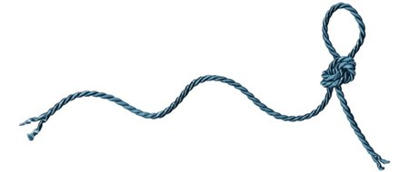

# STC [cstr](../include/stc/cstr.h): String


A **cstr** object represent sequences of characters. It supports an interface similar to that of a standard container of bytes, but adding features specifically designed to operate with strings of single-byte characters, terminated by the null character.

**cstr** has basic support for *UTF8* encoded strings, and has a set of compact and efficient functions for handling case-foldings and comparisons of UTF strings.

**cstr** uses short strings optimization (sso), which eliminates heap memory allocation for string capacity less than 24 bytes. `sizeof(cstr)` is also 24. In comparison, c++ `sizeof(std::string)` is typically 32, but sso capacity is only 15 bytes.

## Header file

All cstr definitions and prototypes are available by including a single header file.

```c
#define i_implement   // define this to implement many functions as shared symbols!
#include <stc/cstr.h>
```

## Methods
```c
cstr        cstr_init(void);                                        // constructor; same as cstr_NULL.
cstr        cstr_lit(const char literal_only[]);                    // cstr from literal; no strlen() call.
cstr        cstr_from(const char* str);                             // constructor using strlen()
cstr        cstr_from_n(const char* str, intptr_t n);               // constructor with n first bytes of str
cstr        cstr_from_sv(csview sv);                                // construct cstr from csview
cstr        cstr_with_capacity(intptr_t cap);
cstr        cstr_with_size(intptr_t len, char fill);                // repeat fill len times
cstr        cstr_from_fmt(const char* fmt, ...);                    // printf() formatting
cstr        cstr_clone(cstr s);

cstr*       cstr_take(cstr* self, cstr s);                          // take ownership of s, i.e. don't drop s.
cstr        cstr_move(cstr* self);                                  // move string to caller, leave self empty
void        cstr_drop(cstr* self);                                  // destructor

const char* cstr_str(const cstr* self);                             // cast to const char*
char*       cstr_data(cstr* self);                                  // cast to mutable char*
csview      cstr_sv(const cstr* self);                              // cast to string view
cstr_buf    cstr_buffer(cstr* self);                                // cast to mutable buffer (with capacity)

intptr_t    cstr_size(const cstr* self);
intptr_t    cstr_capacity(const cstr* self);
bool        cstr_empty(const cstr* self);

char*       cstr_reserve(cstr* self, intptr_t capacity);            // return pointer to buffer
void        cstr_resize(cstr* self, intptr_t len, char fill);
void        cstr_shrink_to_fit(cstr* self);
void        cstr_clear(cstr* self);

char*       cstr_assign(cstr* self, const char* str);
char*       cstr_assign_n(cstr* self, const char* str, intptr_t n); // assign n first bytes of str
char*       cstr_assign_sv(cstr* self, csview sv);
char*       cstr_copy(cstr* self, cstr s);                          // copy-assign a cstr
int         cstr_printf(cstr* self, const char* fmt, ...);          // source and target must not overlap.

char*       cstr_append(cstr* self, const char* str);
char*       cstr_append_n(cstr* self, const char* str, intptr_t n); // append n first bytes of str
char*       cstr_append_sv(cstr* self, csview str);
char*       cstr_append_s(cstr* self, cstr str);
int         cstr_append_fmt(cstr* self, const char* fmt, ...);      // printf() formatting
char*       cstr_append_uninit(cstr* self, intptr_t len);           // return ptr to start of uninited data

void        cstr_push(cstr* self, const char* chr);                 // append one utf8 char
void        cstr_pop(cstr* self);                                   // pop one utf8 char

void        cstr_insert(cstr* self, intptr_t pos, const char* ins);
void        cstr_insert_sv(cstr* self, intptr_t pos, csview ins);
void        cstr_insert_s(cstr* self, intptr_t pos, cstr ins);

void        cstr_erase(cstr* self, intptr_t pos, intptr_t len);     // erase len bytes from pos

void        cstr_replace(cstr* self, const char* search, const char* repl, unsigned count = MAX_INT);
cstr        cstr_replace_sv(csview in, csview search, csview repl, unsigned count);
void        cstr_replace_at(cstr* self, intptr_t pos, intptr_t len, const char* repl); // replace at a pos
void        cstr_replace_at_sv(cstr* self, intptr_t pos, intptr_t len, const csview repl);
void        cstr_replace_at_s(cstr* self, intptr_t pos, intptr_t len, cstr repl);

bool        cstr_equals(const cstr* self, const char* str);
bool        cstr_equals_sv(const cstr* self, csview sv);
bool        cstr_equals_s(const cstr* self, cstr s);

intptr_t    cstr_find(const cstr* self, const char* search);
intptr_t    cstr_find_at(const cstr* self, intptr_t pos, const char* search); // search from pos
bool        cstr_contains(const cstr* self, const char* search);

bool        cstr_starts_with(const cstr* self, const char* str);
bool        cstr_starts_with_sv(const cstr* self, csview sv);
bool        cstr_starts_with_s(const cstr* self, cstr s);

bool        cstr_ends_with(const cstr* self, const char* str);
bool        cstr_ends_with_sv(const cstr* self, csview sv);
bool        cstr_ends_with_s(const cstr* self, cstr s);

bool        cstr_getline(cstr *self, FILE *stream);                 // cstr_getdelim(self, '\n', stream)
bool        cstr_getdelim(cstr *self, int delim, FILE *stream);     // does not append delim to result
```

#### UTF8 methods
```c
intptr_t    cstr_u8_size(const cstr* self);                         // number of utf8 codepoints
intptr_t    cstr_u8_size_n(const cstr self, intptr_t nbytes);       // utf8 size within n bytes  
intptr_t    cstr_u8_to_pos(const cstr* self, intptr_t u8idx);       // byte pos offset at utf8 codepoint index
const char* cstr_u8_at(const cstr* self, intptr_t u8idx);           // char* position at utf8 codepoint index
csview      cstr_u8_chr(const cstr* self, intptr_t u8idx);          // get utf8 character as a csview
void        cstr_u8_replace_at(cstr* self, intptr_t bytepos, intptr_t u8len, csview repl); // replace u8len utf8 chars
void        cstr_u8_erase(cstr* self, intptr_t bytepos, intptr_t u8len); // erase u8len codepoints from pos

// iterate utf8 codepoints
cstr_iter   cstr_begin(const cstr* self);
cstr_iter   cstr_end(const cstr* self);
void        cstr_next(cstr_iter* it);
cstr_iter   cstr_advance(cstr_iter it, intptr_t n);

// utf8 functions requires linking with src/utf8code.c symbols:
bool        cstr_valid_utf8(const cstr* self);                      // check if str is valid utf8
cstr        cstr_casefold_sv(csview sv);                            // returns new casefolded utf8 cstr

cstr        cstr_tolower(const char* str);                          // returns new lowercase utf8 cstr
cstr        cstr_tolower_sv(csview sv);                             // returns new lowercase utf8 cstr
void        cstr_lowercase(cstr* self);                             // transform cstr to lowercase utf8

cstr        cstr_toupper(const char* str);                          // returns new uppercase utf8 cstr
cstr        cstr_toupper_sv(csview sv);                             // returns new uppercase utf8 cstr
void        cstr_uppercase(cstr* self);                             // transform cstr to uppercase utf8
 
int         cstr_icmp(const cstr* s1, const cstr* s2);              // utf8 case-insensitive comparison
bool        cstr_iequals(const cstr* self, const char* str);        //   "
bool        cstr_istarts_with(const cstr* self, const char* str);   //   "
bool        cstr_iends_with(const cstr* self, const char* str);     //   "
```

Note that all methods with arguments `(..., const char* str, intptr_t n)`, `n` must be within the range of `str` length.

#### Helper methods:
```c
int          cstr_cmp(const cstr* s1, const cstr* s2);
bool         cstr_eq(const cstr* s1, const cstr* s2);
bool         cstr_hash(const cstr* self);

char*        cstrnstrn(const char* str, const char* search, intptr_t slen, intptr_t nlen);
```

## Types

| Type name       | Type definition                              | Used to represent... |
|:----------------|:---------------------------------------------|:---------------------|
| `cstr`          | `struct { ... }`                             | The string type      |
| `cstr_value`    | `char`                                       | String element type  |
| `csview`        | `struct { const char *str; intptr_t size; }` | String view type     |
| `cstr_buf`      | `struct { char *data; intptr_t size, cap; }` | String buffer type   |

## Constants and macros

| Name              | Value             |
|:------------------|:------------------|
|  `c_NPOS`         | `INTPTR_MAX`      |
|  `cstr_NULL`      | cstr null value   |

## Example
```c
#include <stc/cstr.h>

int main() {
    cstr s0, s1, full_path;
    c_defer(
        cstr_drop(&s0),
        cstr_drop(&s1),
        cstr_drop(&full_path)
    ){
        s0 = cstr_lit("Initialization without using strlen().");
        printf("%s\nLength: %" c_ZI "\n\n", cstr_str(&s0), cstr_size(&s0));

        s1 = cstr_lit("one-nine-three-seven-five.");
        printf("%s\n", cstr_str(&s1));

        cstr_insert(&s1, 3, "-two");
        printf("%s\n", cstr_str(&s1));

        cstr_erase(&s1, 7, 5); // -nine
        printf("%s\n", cstr_str(&s1));

        cstr_replace(&s1, "seven", "four", 1);
        printf("%s\n", cstr_str(&s1));

        // reassign:
        cstr_assign(&s1, "one two three four five six seven");
        cstr_append(&s1, " eight");
        printf("append: %s\n", cstr_str(&s1));

        full_path = cstr_from_fmt("%s/%s.%s", "directory", "filename", "ext");
        printf("%s\n", cstr_str(&full_path));
    }
}
```
Output:
```
one-nine-three-seven-five.
one-two-nine-three-seven-five.
one-two-three-seven-five.
one-two-three-four-five.
append: one two three four five six seven eight
directory/filename.ext
```
