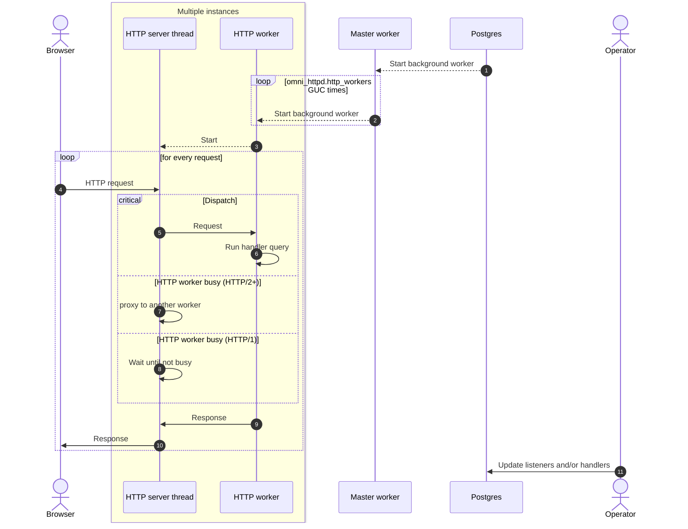

# Architecture

omni_httpd serves HTTP connections
by employing a fleet of background workers.

There's a master worker that handles starting HTTP workers
and handling configuration change requests [^1]

[^1]:
Triggered by changes to `omni_httpd.listeners` or manually
using `omni_httpd.reload_configuration()`)

There are multiple HTTP workers [^2]. Each HTTP worker is an instance of Postgres and
can therefore handle incoming requests. This is done by running a matching [route handler](routing.md)
on the main thread, and handling network I/O of HTTP requests and responses on a secondary thread [^3].

[^2]:
Can be configured using `omni_httpd.http_workers` configuration variable. Defaults to number of CPU cores online.

[^3]:
This thread is strictly prohibited from calling into Postgres.

To enable scenarios where multiplexing is possible (such as HTTP/2), omni_httpd
will attempt to re-send incoming HTTP/2 (or higher) requests to other workers
if the current worker is busy handling a request.

Below is a diagram outlining general workflow.

??? tip "Want to know more?"

    * :two: Master worker opens the listening socket and shares it with HTTP
       workers over a UNIX socket (using `SCM_RIGHTS`). More work needs to
       be done to improve this. Please consider [contributing](https://github.com/omnigres/omnigres/issues/41)!
    * :three: Actual HTTP functionality is enabled by awesome [h2o](https://h2o.examp1e.net/) web server. Particularly,
      its libh2o component.
