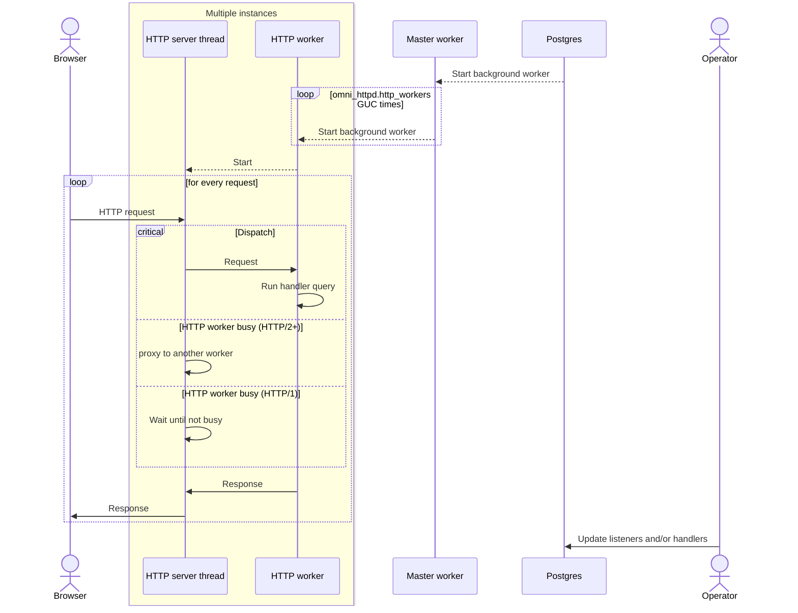

# Architecture

```mermaid
sequenceDiagram
    actor B as Browser
    box lightyellow Multiple instances
      participant H as HTTP server thread
      participant HW as HTTP worker
    end
    participant MW as Master worker
    participant P as Postgres
    actor O as Operator
   
    P -->> MW: Start background worker
    loop omni_httpd.http_workers GUC times
      MW -->> HW: Start background worker
    end
    HW -->> H: Start
    loop for every request
      B ->> H: HTTP request
      critical Dispatch
       H ->> HW: Request
       HW ->> HW: Run handler query
      option HTTP worker busy (HTTP/2+)
       H ->> H: proxy to another worker
      option HTTP worker busy (HTTP/1)
       H ->> H: Wait until not busy
      end
      HW ->> H: Response
      H ->> B: Response
    end

    O ->> P: Update listeners and/or handlers
```