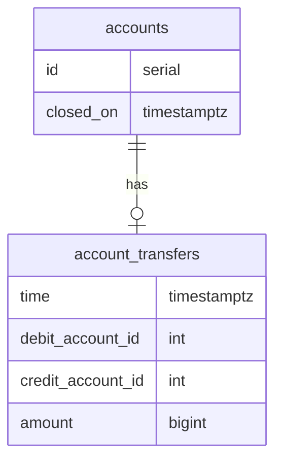

# Transaction Linearization

!!! warning "Experimental feature"

    Please be advised that this is a very new, experimental feature.
    The soundness of the approach or the implementation has not been fully vetted yet.

For most common cases, transaction isolation levels like [
`serializable`](https://www.postgresql.org/docs/current/transaction-iso.html#XACT-SERIALIZABLE) are sufficient to avoid
problems with concurrent transactions.

There are, however, cases where this may not be enough and Postgres won't be tracking complex
dependencies in your operations provided they don't form
so-called [dangerous structures](https://www.sciencedirect.com/science/article/abs/pii/S0306437916300461).

When transaction T<sub>1</sub> writes to tables R<sub>w</sub> are logically dependent
on reads from R<sub>r</sub>, Postgres won't be able to make detect a conflict with another
transaction T<sub>2</sub> that may have written to R<sub>r</sub> after T<sub>1</sub> read from it
if T<sub>2</sub> would commit changes sooner than T<sub>1</sub>. This may result in a state that is
logically inconsistent if operations on entities are deemed unrelated.

For this, we introduce a limited, experimental tooling for _linearizing_ transaction.

!!! quote "To quote [Jepsen](https://jepsen.io/consistency/models/linearizable)"

    Linearizability is one of the strongest single-object consistency models, and implies that every operation appears to take place atomically, in some order, consistent with the real-time ordering of those operations: e.g., if operation A completes before operation B begins, then B should logically take effect after A.

To facilitate such a mode, we introduce a few rules (_SLT_: serializable, linearized transaction):

1. Any write in  _SLT_<sub>1</sub> that happens after another _SLT_<sub>0</sub>
   read from the same relation, must result in a serialization linearization failure
   in either transaction.
2. Any commit in _SLT_<sub>1</sub> that wrote into a relation
   that happens after another _SLT_<sub>0</sub> read from the same relation, must result
   in a serialization linearization failure in either transaction.
3. Any commit in _SLT_<sub>1</sub> that wrote into a relation
   after any _SLT_<sub>n</sub> has obtained a snapshot, must result
   in a serialization linearization failure in either transaction,
   provided _SLT_<sub>n</sub> will read from this relation.

In all cases, false failures are possible and [transaction retrying](retry.md) strategy
is advisable.

# Motivating example

Let's imagine an oversimplified _financial account system_.

<center>

</center>

??? question "Want to see the schema?"

    ```postgresql
    
    ```

**Importantly**, accounts may be closed at some point. After the closure,
_new transfers_ must not occur.

Let's create some accounts:

```postgresql
insert into accounts (id)
values (1),
       (2);
```

It is only natural to employ serializable transaction for modelling
financial domain. Let's start moving the money.

```postgresql
-- [[T0: first transaction]]
begin transaction isolation level serializable;
--- Transfer some more money, check that the account is not closed 
with allowed_accounts as (select *
                          from accounts a
                          where closed_on is null)
insert
into account_transfers (debit_account_id, credit_account_id, amount)
select id, 2, 100
from allowed_accounts
where id = 1;
--- Now there's a transfer in `account_transfers`
```

Without commiting this transaction, we now execute another transaction that
closes the account:

```postgresql
--- [[T1: another transaction]]
begin transaction isolation level serializable;
update accounts
set closed_on = statement_timestamp()
where id = 1;
commit;
```

And only then we commit the original transaction:

```postgresql
--- first[[T0]]
--- Wait for some time – doing something important
select pg_sleep(5);
--- Done!
commit;
```

!!! danger "What happened here?"

    Both transaction committed successfully, but if we look closely, we'll see that
    for practical reasons, we have a transfer recorded after the account was closed.
    The administrator closed the account, saw the response but _after_ that,
    a new transfer appeared. Now, we have a closed account with a non-zero balance.

Is something wrong with serializable transactions? Well, no. They simply guarantee
**a** serial order of execution. Not necessarily the one that was observed.

If we redo the same with linearized transactions:

```postgresql
-- [[T0: first transaction]]
begin transaction isolation level serializable;
--- Linearize
select omni_txn.linearize();
--- Transfer some more money, check that the account is not closed 
with allowed_accounts as (select *
                          from accounts a
                          where closed_on is null)
insert
into account_transfers (debit_account_id, credit_account_id, amount)
select id, 2, 100
from allowed_accounts
where id = 1;
--- Now there's a transfer in `account_transfers`
```

And then the other transaction:

```postgresql
--- [[T1: another transaction]]
begin transaction isolation level serializable;
--- Linearize
select omni_txn.linearize();
--- Close the account
update accounts
set closed_on = statement_timestamp()
where id = 1;
commit;
--- ERROR:  linearization failure
--- DETAIL:  transaction 747 has a predicate lock on `accounts`
```

Now, we observed a serialization linearization failure! In this particular
case, we observed that another transaction already tried to read accounts
(_to see if the account was closed_) and, out of abundance of caution, we should
retry or fail.

And we can now commit the first one!

```postgresql
--- first[[T0]]
--- Wait for some time – doing something important
select pg_sleep(5);
--- Done!
commit;
```

The above example is not representative of a realistic system, but
is only meant to illustrate want kind of conflicts one can guard for.
In this particular example, it shows how it prevented the invalid
state of a closed account with a balance.

# Quick start

To linearize, you must be in a serializable transaction first. After that, all you
need to do is
invoke the following function:

```postgresql
select omni_txn.linearize();
-- to check if we're in a linearized transaction
select omni_txn.linearized();
--#> t
```

It will make current transaction linearized. It will start to intercept all mutating
statements like INSERT, UPDATE, DELETE, and MERGE.

Should a linearization failure occur, it will raise a serialization error exception with
particular details of the failure.

This is compatible with [`omni_txn.retry`](retry.md) primitive, allowing to build effective
mechanisms for handling such constraints.

